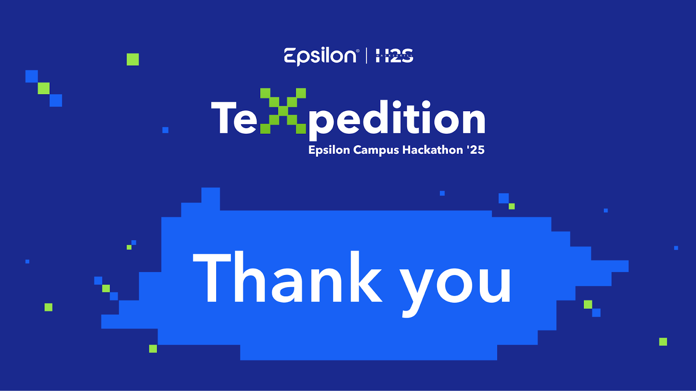

<!-- Banner Image -->
<p align="center">
  
</p>

# GanMA-Ai: AI Sidebar Taskbar Extension

**Epsilon Campus Hackathon '25 Submission**

---

**Live Website Link:** [View Live Extension](https://ganma-ai-website.onrender.com/) *(click me)*  
**Demo Video:** [Watch Full Demo & Setup](https://drive.google.com/file/d/1f7QCfv78kirarrqcdw6QlEjBUvu3Lt_O/view?usp=drive_link) *(click me)*  
**Alternate Demo (6 min):** [Watch Alternate Video](https://drive.google.com/file/d/1Gpd4uobP885iZolYPyujoKr7lo2Hk7-Y/view?usp=drive_link) *(click me)*

---

## 🚀 Overview

GanMA-Ai is a Chrome extension that injects a powerful AI-driven sidebar into every webpage, enabling features like Market Analysis, Feedback Analysis, Text-to-Image generation, and Ethical AI insights—all accessible with a single click.

> **Note:** The Enter key has been disabled to prevent accidental submissions. After typing your prompt in the chat input, use your mouse to click the “Send” button to submit your request.

---

## 🛠️ Features

- **Market Analysis:** Get real-time market insights powered by AI.  
- **Feedback Analysis:** Instantly analyze user feedback and sentiment.  
- **Text-to-Image:** Generate images from text prompts using AI.  
- **Ethical AI:** Access ethical guidelines and AI best practices.  
- **User Authentication:** Secure login/signup modal for a personalized experience.

---

## 📂 Project Structure

```plaintext
GanMA-Ai-main/
│
├── assets/
│   └── ganma-ai-extension/
│       └── aiagent-frontend/
│           ├── auth.js
│           ├── content.js
│           ├── icon.png
│           ├── manifest.json
│           ├── package-lock.json
│           ├── sidebar.css
│           ├── sidebar.html
│           └── sidebar.js
└── index.html
````

---

## 🧑‍💻 Step-by-Step Setup & Execution

1. **Clone the Repository**

   ```bash
   git clone <repo-url>
   cd GanMA-Ai-main/assets/ganma-ai-extension/aiagent-frontend
   ```

2. **Install Dependencies**

   > No external dependencies required; all scripts and styles are included locally.

3. **Load the Extension in Chrome**

   1. Open Chrome and navigate to `chrome://extensions/`.
   2. Enable **Developer mode** (toggle at top right).
   3. Click **Load unpacked**.
   4. Select the folder: `GanMA-Ai-main/assets/ganma-ai-extension/aiagent-frontend`.
   5. The **AI Sidebar Taskbar** extension will appear in your extensions list.

4. **Using the Extension**

   * Navigate to any webpage; the AI Sidebar will automatically appear.
   * Click sidebar icons to access Market Analysis, Feedback Analysis, Text-to-Image, and Ethical AI features.
   * Click the user icon to log in or sign up.

5. **Backend/API**

   * The extension communicates with the backend at `https://ganma-backend.onrender.com/` for AI processing.
   * No local backend setup is required for basic usage.

---

## 📸 Screenshots

<p align="center">
  
</p>

---

## 📄 License

This project is provided for educational and hackathon purposes.

---

## 🙏 Acknowledgements

* Epsilon Campus Hackathon '25
* All contributors and mentors

---

<p align="center">
  
</p>
```
